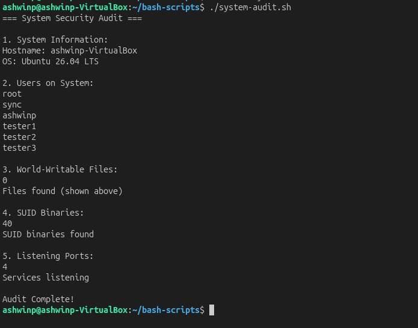
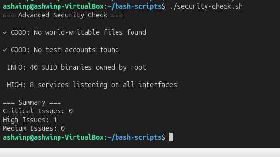
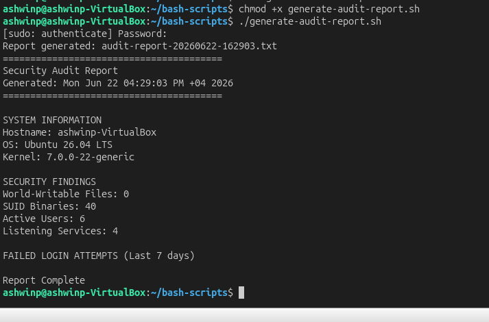

# Bash Scripting for Security Automation

## Objective
Learn to write practical bash scripts that automate security audits and checks.

## What I Did
1. Created a system audit script that gathers security information
2. Built an advanced security check script that identifies vulnerabilities
3. Developed a report generation script that creates timestamped audit reports
4. Tested all scripts and documented findings

## Scripts Created

### 1. system-audit.sh
Quick security overview script that shows:
- System hostname and OS information
- Active users on system
- World-writable files count
- SUID binaries count
- Listening network services

**Usage:**
```bash
./system-audit.sh
```

### 2. security-check.sh
Advanced vulnerability detection script that:
- Identifies world-writable files (CRITICAL)
- Detects unused test accounts (HIGH)
- Counts SUID binaries
- Finds services exposed to external network (HIGH)
- Provides risk summary

**Key Findings:**
- Critical Issues: 0
- High Issues: 1 (8 services on all interfaces)
- Medium Issues: 0

**Usage:**
```bash
./security-check.sh
```

### 3. generate-audit-report.sh
Automated report generation script that:
- Creates timestamped report files
- Gathers system information
- Identifies security issues
- Documents failed login attempts
- Exports data to file for archival

**Usage:**
```bash
./generate-audit-report.sh
```

## Key Skills Learned

### Bash Fundamentals
- Variables and command substitution
- Conditional statements (if/else)
- Loops and iteration
- Functions and parameters
- Input/output redirection

### Security Automation
- Automated system audits
- Vulnerability detection
- Report generation
- Data parsing and analysis
- Log monitoring

### Best Practices
- Meaningful script names
- Clear comments and documentation
- Error handling
- Executable permissions
- Output formatting

## Security Implications

Bash scripting is essential in cybersecurity for:
- **Security Automation** — automate repetitive checks
- **Log Analysis** — parse and analyze logs at scale
- **Vulnerability Scanning** — automated security assessment
- **Incident Response** — quickly gather forensic data
- **Compliance** — automated compliance audits

## Commands Used
```bash
#!/bin/bash                                    # Shebang for bash
echo "text"                                    # Print output
$(command)                                     # Command substitution
[ condition ]                                  # Conditional test
if [ condition ]; then ... fi                 # If statement
grep pattern file                             # Pattern matching
wc -l                                         # Count lines
chmod +x script.sh                            # Make executable
./script.sh                                   # Execute script
> file.txt                                    # Redirect output
```

## What I Learned

Bash scripting is the **foundation of systems administration and security automation**. Key takeaways:

1. **Automation Saves Time** — Scripts perform repetitive tasks instantly
2. **Consistency** — Automated audits are consistent every time
3. **Data Processing** — Can parse and analyze large amounts of data
4. **Integration** — Scripts combine multiple tools into workflows
5. **Scalability** — Same script works on any Linux system

This is why every cybersecurity professional needs scripting skills:
- Penetration testers write scripts to automate reconnaissance
- Security analysts write scripts to process and analyze logs
- System admins write scripts for security updates and hardening
- Security teams write scripts to detect threats at scale

## Screenshots

### System Audit Script Output

*Comprehensive system security overview*

### Advanced Security Check

*Vulnerability detection with risk assessment*

### Report Generation

*Automated timestamped audit report*
