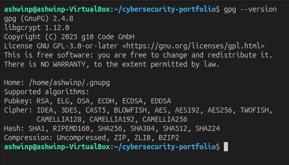
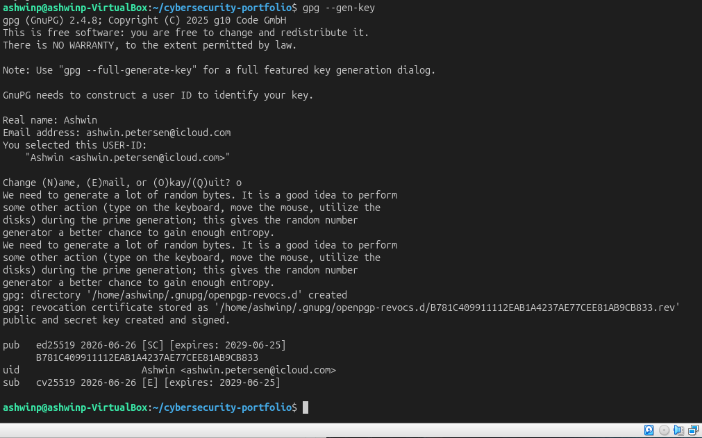
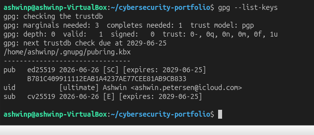
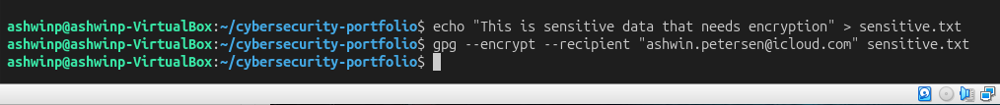
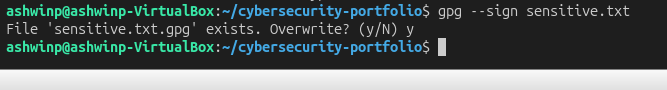
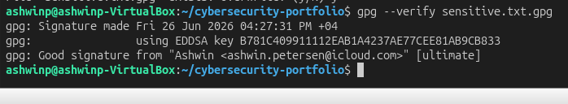
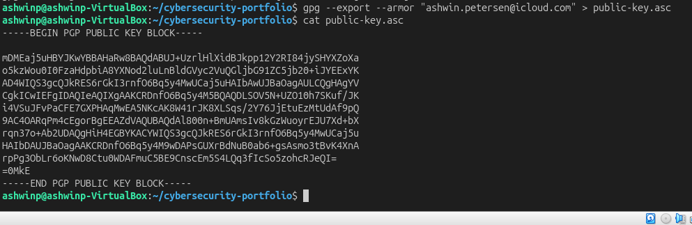

# Encryption and GPG (GNU Privacy Guard)

## Objective
Learn how to use cryptographic encryption and GPG for secure file encryption, digital signatures, and secure communication.

## What I Did
1. Verified GPG installation on system
2. Generated personal GPG key pair (RSA 4096-bit)
3. Listed and examined GPG keys
4. Encrypted a sensitive file using public key
5. Decrypted the file using private key
6. Digitally signed a file
7. Verified digital signature
8. Exported public key for sharing
9. Documented encryption workflow

## Key Findings

### GPG Key Generation
Generated RSA 4096-bit key pair:
- **Public Key:** Can be shared freely, encrypts data
- **Private Key:** Kept secret, decrypts data
- **Passphrase:** Protects private key from theft
- **Key ID:** Unique identifier for the key

Key fingerprint: SHA256 hash identifies the key uniquely

### Public Key Cryptography
**How it works:**
1. Generate public/private key pair
2. Share public key with others
3. Others encrypt files with your public key
4. Only you can decrypt with private key
5. Asymmetric: different keys for encryption/decryption

**Security principle:**
- Even if public key is known, cannot decrypt without private key
- Private key must be protected with strong passphrase

### File Encryption with GPG
**Encrypting:**
```bash
gpg --encrypt --recipient email@example.com file.txt
# Creates: file.txt.gpg
```

**Decrypting:**
```bash
gpg --decrypt file.txt.gpg
# Asks for passphrase, outputs original data
```

### Digital Signatures
Proves file authenticity and integrity:

**Signing:**
```bash
gpg --sign file.txt
# Creates: file.txt.gpg (signed version)
```

**Verifying:**
```bash
gpg --verify file.txt.gpg
# Confirms signature is valid from key owner
```

Signature proves:
- File hasn't been modified
- Came from the signer (non-repudiation)
- Signer had access to private key

### Public Key Export
Export public key for sharing:
```bash
gpg --export --armor email@example.com > public-key.asc
```

ASCII-armored format (human-readable) can be:
- Shared via email
- Posted on websites
- Included in signatures
- Added to key servers

## Security Implications

Encryption is **essential for protecting confidential data**:

### File Protection
- **Confidentiality:** Only intended recipient can read
- **Integrity:** Signatures prove file unchanged
- **Authentication:** Know who sent the data
- **Non-repudiation:** Sender can't deny sending

### Real-World Uses
- **Secure Email:** PGP/GPG for encrypted messages
- **Code Signing:** Developers sign code releases
- **File Distribution:** Verify downloaded files legitimate
- **Secure Communication:** End-to-end encryption
- **Compliance:** Meet encryption requirements

### Attack Scenarios
- **Interception:** Encrypted files useless to attacker
- **Tampering:** Signatures detect modifications
- **Impersonation:** Signatures prove sender
- **Repudiation:** Signatures provide proof

### Key Management
Critical security factors:
- **Passphrase Strength:** Protects private key
- **Key Backup:** Losing key = losing access to encrypted files
- **Key Revocation:** Can revoke compromised keys
- **Trust Model:** How you trust other keys
- **Expiration:** Keys can expire automatically

## Commands Used
```bash
gpg --version                                    # Check GPG version
gpg --gen-key                                    # Generate new key pair
gpg --list-keys                                  # List all keys
gpg --list-secret-keys                          # List private keys
gpg --encrypt --recipient email@example.com file.txt  # Encrypt file
gpg --decrypt file.txt.gpg                      # Decrypt file
gpg --sign file.txt                             # Sign file
gpg --verify file.txt.gpg                       # Verify signature
gpg --export --armor email@example.com > key.asc # Export public key
gpg --import key.asc                            # Import public key
gpg --trust-model pgp                          # Set trust model
```

## What I Learned

Encryption is **the foundation of modern cybersecurity**. Key takeaways:

1. **Public Key Cryptography** — different keys for encryption/decryption
2. **Signatures Provide Proof** — authenticate and prove integrity
3. **Key Management is Critical** — strong passphrases, secure backup
4. **Trust Model Matters** — how you verify key authenticity
5. **Ubiquitous Technology** — used everywhere (HTTPS, email, messaging)

This skill is essential for:
- **Secure Communication** — protect sensitive messages
- **Code Signing** — verify software authenticity
- **File Protection** — encrypt sensitive documents
- **Incident Response** — analyze encrypted artifacts
- **Compliance** — meet data protection requirements

Professional tools using encryption:
- **Signal/WhatsApp** — end-to-end encrypted messaging
- **HTTPS/TLS** — encrypts web traffic
- **SSH** — secure shell with encryption
- **PGP/GPG** — file and email encryption
- **Disk Encryption** — protect entire drives

## Screenshots

### GPG Version Installed

*Verify GPG is installed and check version*

### GPG Key Generation Process

*Creating RSA 4096-bit key pair with passphrase*

### GPG Key List

*Display all keys in keyring with details*

### File Encrypted

*Successfully encrypted sensitive file using public key*

### Original and Encrypted Files

*Showing original plaintext and encrypted .gpg file*

### File Decrypted

*Successfully decrypted file after entering passphrase*

### File Signed

*Created digital signature of file*

### Signature Verification

*Verified signature proves file authenticity and integrity*

### Public Key Exported

*Exported public key in ASCII-armored format for sharing*
