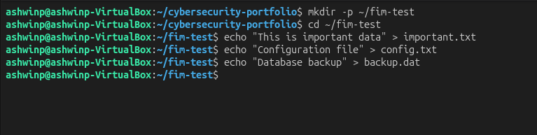
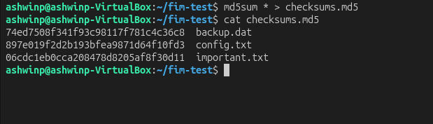
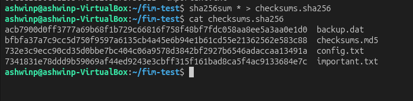
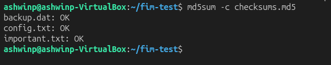
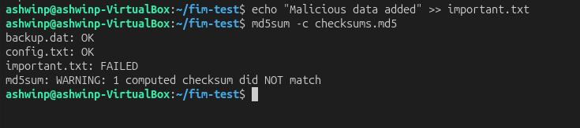
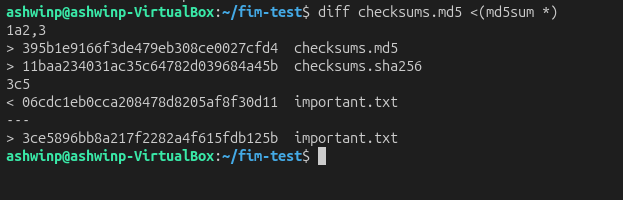
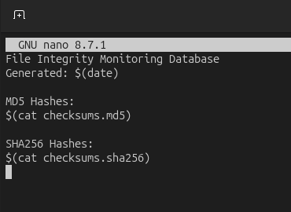

# File Integrity Monitoring

## Objective
Learn how to detect unauthorized file modifications using cryptographic hashing and file integrity monitoring techniques.

## What I Did
1. Created test files to monitor
2. Generated MD5 checksums for baseline
3. Generated SHA256 checksums (more secure)
4. Verified checksums pass on unmodified files
5. Modified a file to test detection
6. Ran verification again (detected modification)
7. Created a File Integrity Monitoring database
8. Documented hash differences before/after modification

## Key Findings

### Understanding Hashing
Hashing creates a unique fingerprint of a file:
- **MD5:** 128-bit hash (legacy, faster but weaker)
- **SHA256:** 256-bit hash (modern, more secure)
- Any change to file = completely different hash
- Hash changes reveal tampering

### MD5 vs SHA256
**MD5 (Deprecated but still useful for demonstration):**
- Faster to compute
- Collision vulnerabilities discovered
- Not recommended for security-critical use
- Still useful for detecting accidental changes

**SHA256 (Recommended):**
- Cryptographically secure
- No known practical collisions
- Slower than MD5 but acceptable
- Industry standard for integrity verification

### File Integrity Monitoring Process

**Step 1: Create Baseline**
Generate hashes of all files in known-good state

**Step 2: Store Baseline**
Save hashes in secure location, protect from tampering

**Step 3: Regular Verification**
Periodically recompute hashes and compare:
- Match = file unchanged
- Different = file modified (possibly compromised)

**Step 4: Alert on Changes**
Unauthorized changes trigger alerts for investigation

### Real-World Application
**Malware Detection:**
- Malware modifies system files
- File hash changes reveal infection
- Can detect rootkits and trojans

**Integrity Verification:**
- Confirm downloaded files are genuine
- Detect corruption or partial downloads
- Verify backups are complete

**Compliance:**
- Many regulations require file monitoring
- HIPAA, PCI-DSS require integrity checking
- Audit trail of file changes

## Security Implications

File Integrity Monitoring is **essential for detecting compromises**:

### Attack Detection
- **Malware Installation:** Changes system files
- **Configuration Changes:** Unauthorized modifications
- **Data Tampering:** Altered critical files
- **Rootkit Installation:** Modifies kernel/system files

### Incident Response
- **Discovery:** Hashes reveal what was changed
- **Timeline:** When changes occurred
- **Scope:** Which files compromised
- **Recovery:** Identify clean vs infected versions

### Limitations
- Hash verification only detects changes
- Doesn't prevent changes
- Attacker can modify hashes if database compromised
- Monitoring overhead on large systems

## Commands Used
```bash
md5sum file                    # Generate MD5 hash
sha256sum file                 # Generate SHA256 hash
md5sum * > checksums.md5       # Create hash database
md5sum -c checksums.md5        # Verify hashes
sha256sum -c checksums.sha256  # Verify SHA256 hashes
diff file1 file2              # Compare files
ls -l filename                # Check modification time
stat filename                 # Detailed file information
```

## What I Learned

File Integrity Monitoring is **critical for security operations**. Key takeaways:

1. **Hashing is Powerful** — tiny changes create completely different hashes
2. **Detection > Prevention** — can't prevent all changes, but can detect them
3. **Baseline is Critical** — need known-good baseline to detect changes
4. **Secure Storage** — hash database itself must be protected
5. **Regular Monitoring** — must check regularly to detect intrusions

This skill is essential for:
- **System Administration** — detect unauthorized changes
- **Security Monitoring** — identify compromises early
- **Incident Response** — investigate breaches
- **Compliance** — meet regulatory requirements
- **Malware Detection** — discover infections

Many professional tools use this concept:
- **AIDE** — Advanced Intrusion Detection Environment
- **Tripwire** — Enterprise file integrity monitoring
- **Osquery** — Real-time system monitoring
- **YARA** — Malware identification rules

## Screenshots

### Test Files Created

*Created sample files to monitor*

### MD5 Checksums Generated

*Baseline hashes created for each file*

### SHA256 Checksums Generated

*More secure SHA256 hashes for integrity*

### Verifying Checksums Pass

*All files match original hashes - no tampering*

### Checksum Verification Fails After Modification

*Modified file detected - hash no longer matches*

### Showing Hash Differences

*Comparison shows exactly which files changed*

### FIM Database Created

*Database with baseline hashes for future monitoring*
