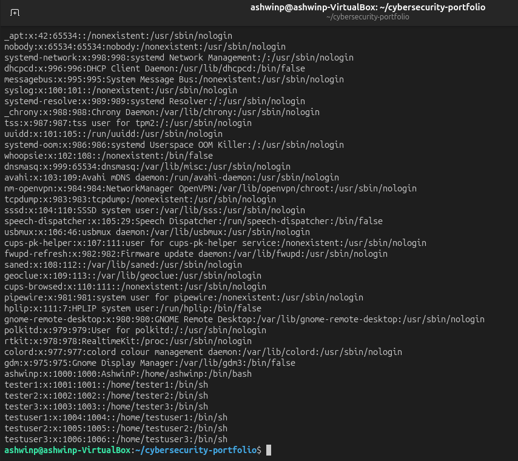
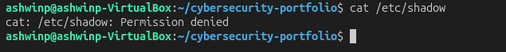
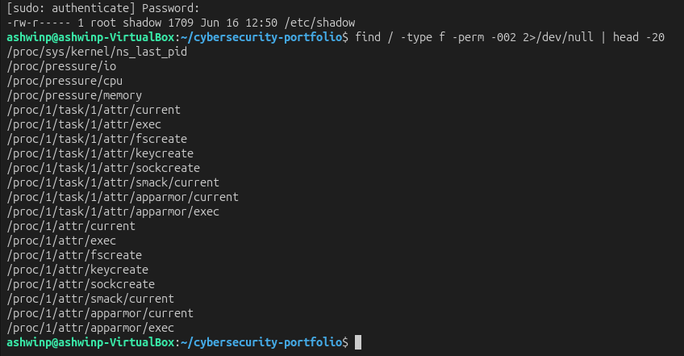
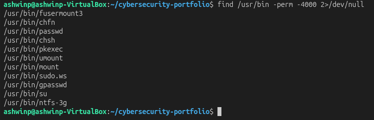
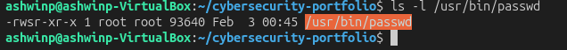
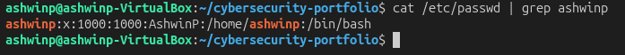
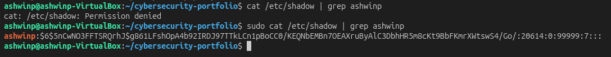

# Understanding Linux File System Security

## Objective
Learn how to identify security risks in a Linux file system, including sensitive files, world-writable files, and dangerous SUID binaries.

## What I Did
1. Examined sensitive system files (`/etc/passwd` and `/etc/shadow`)
2. Compared their permissions and understood why they're different
3. Searched for world-writable files on the system
4. Found and analyzed SUID binaries
5. Understood why certain programs need elevated privileges

## Key Findings

### /etc/passwd vs /etc/shadow - The Security Difference

**`/etc/passwd` Permissions:** `-rw-r--r--`
- Readable by everyone on the system
- Contains: username, user ID, group ID, home directory, shell
- Safe to be world-readable because it contains no sensitive data
- Programs need to look up usernames, so it must be readable

**`/etc/shadow` Permissions:** `-rw-r-----`
- Only readable by root and the shadow group
- Contains: encrypted password hashes
- **CRITICAL SECURITY FILE** — if attackers get this file, they can try to crack passwords offline
- Protected by strict permissions (principle of least privilege)

**Security Lesson:** This is a perfect example of the principle of least privilege — give only the minimum permissions needed. `/etc/passwd` is safe to share, but `/etc/shadow` must be protected.

### World-Writable Files - A Major Risk

I found world-writable files using: `find / -type f -perm -002 2>/dev/null`

Results showed files in:
- `/proc/` — virtual filesystem (system files, not a direct threat)
- `/sys/` — virtual filesystem (system files, not a direct threat)
- Temporary directories could be dangerous if world-writable

**Why This Matters:** World-writable files in production servers can lead to:
- Data tampering
- Malware injection
- Privilege escalation attacks
- System compromise

### SUID Binaries - Necessary But Dangerous

I found SUID binaries using: `find /usr/bin -perm -4000 2>/dev/null`

Key findings:
- `/usr/bin/passwd` — allows regular users to change their password (needs root to write to `/etc/shadow`)
- `/usr/bin/sudo` — allows authorized users to run commands as root
- `/usr/bin/chfn`, `/usr/bin/chsh` — allow changing user information
- `/usr/bin/su` — switch user

**Why They Need SUID:**
Regular users need to change their password, but `/etc/shadow` is protected. The `passwd` command has SUID set, so it can run as root and safely modify the shadow file. This prevents users from directly accessing the password file while still allowing them to change their own password.

**Security Risk:** If SUID binaries are misconfigured or have vulnerabilities, attackers can exploit them for privilege escalation.

## Security Implications

In real-world servers:
- System administrators must regularly audit file permissions
- Sensitive files like `/etc/shadow` MUST be protected
- SUID binaries should be minimal and carefully audited
- World-writable directories should only exist where necessary (like `/tmp`)
- Many security breaches involve exploiting file permission misconfigurations

## Commands I Used
```bash
cat /etc/passwd                      # View user accounts
cat /etc/shadow                      # View password hashes (permission denied for regular users)
ls -la /etc/passwd /etc/shadow       # Compare permissions
find / -type f -perm -002 2>/dev/null  # Find world-writable files
find /usr/bin -perm -4000 2>/dev/null  # Find SUID binaries
ls -l /usr/bin/passwd                # View SUID binary details
sudo cat /etc/shadow | grep username # View shadow file with elevated privileges
```

## What I Learned

This exercise taught me that **file permissions are the foundation of Linux security**. Key takeaways:

1. **Principle of Least Privilege** — Always restrict access to the minimum needed. `/etc/shadow` doesn't need to be world-readable, so it's protected.

2. **SUID is a Double-Edged Sword** — While necessary for some functions, SUID binaries can be exploited if misconfigured. Security teams constantly audit these.

3. **File System Auditing is Critical** — Finding world-writable files and SUID binaries is part of routine security audits. Many breaches happen because these files aren't properly monitored.

4. **Sensitive Files Need Protection** — Password hashes, SSH keys, and configuration files must have strict permissions.

This is why system administrators run regular security audits and why this is one of the first things penetration testers check when assessing a system.

## Screenshots

### User Accounts on the System

*Viewing all user accounts in /etc/passwd*

### Permission Denied on Shadow File

*Regular users cannot read /etc/shadow — perfect security design*

### World-Writable Files

*Finding files that anyone can modify — a potential security risk*

### SUID Binaries

*Programs with SUID set that run with elevated privileges*

### Understanding SUID Details

*The 's' in permissions indicates SUID — runs with owner's privileges*

### Checking Username in Shadow

*Viewing specific user entry in shadow file with elevated privileges*

### Password Hash Visibility

*Encrypted password hashes are stored securely in /etc/shadow*
