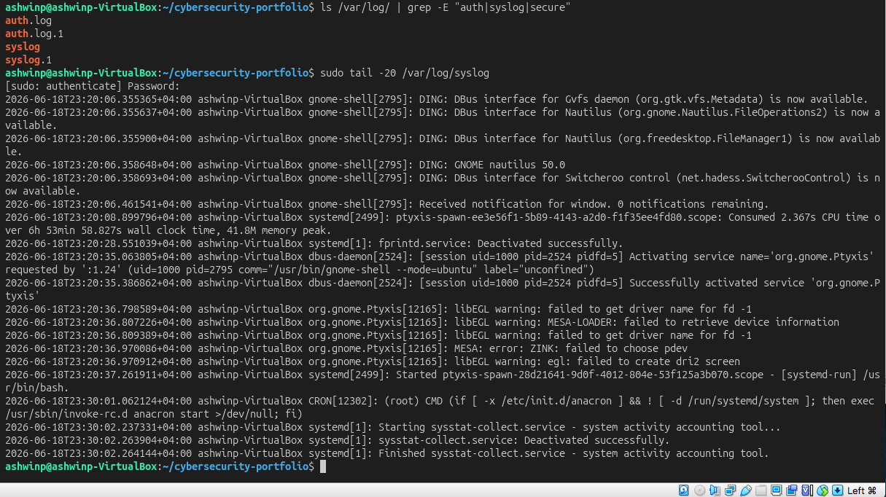
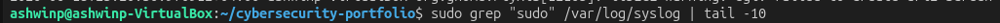
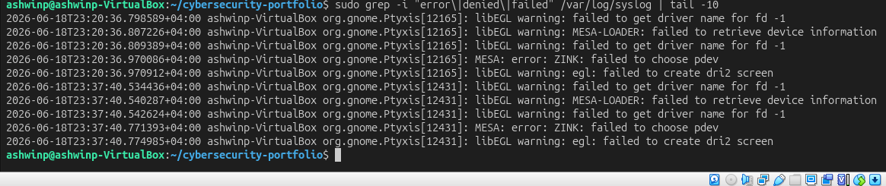
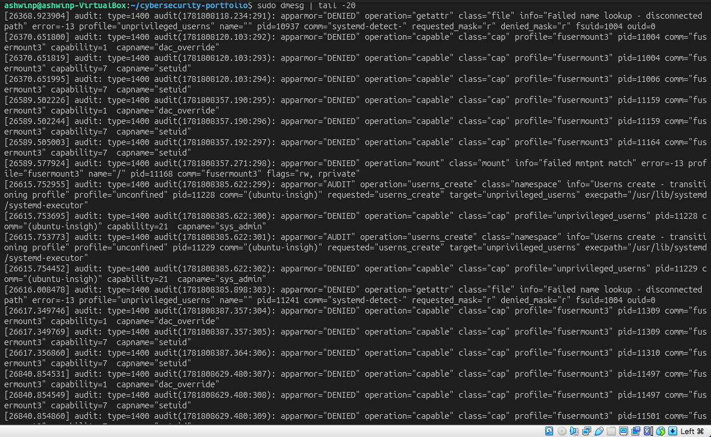
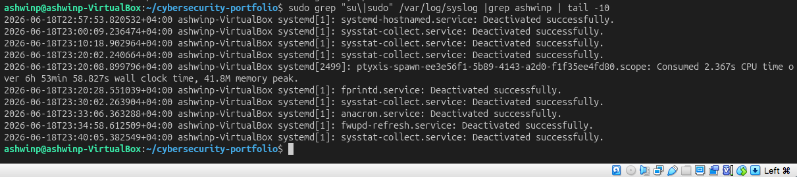

# Understanding Linux Log Analysis

## Objective
Learn how to locate, read, and analyze system logs to identify user activity, failed login attempts, errors, and security events.

## What I Did
1. Explored the Linux log directory structure (`/var/log/`)
2. Examined system logs in syslog
3. Searched for specific patterns (errors, failures, sudo usage)
4. Identified failed login attempts and denied access
5. Tracked user privilege changes and sudo commands
6. Analyzed kernel messages for system events

## Key Findings

### System Log Location
Linux stores logs in `/var/log/` directory. Key log files:
- `/var/log/syslog` — combined system and kernel messages
- `/var/log/auth.log` — authentication attempts (if available)
- `/var/log/dmesg` — kernel messages and hardware events
- Various service-specific logs in subdirectories

Each log contains timestamps, source process, and detailed messages about system events.

### Log Format and Information
System logs follow a standard format:
- **Timestamp** — when the event occurred
- **Hostname** — which system (useful in multi-server environments)
- **Process/Service** — what generated the log
- **Message** — details about what happened (succeeded, failed, error details)

Example: `sudo: ashwinp : TTY=pts/0 ; PWD=/home/ashwinp ; USER=root ; COMMAND=/bin/ls`

This shows:
- User who ran sudo (ashwinp)
- Terminal type (pts/0)
- Working directory
- Target user (root)
- Actual command executed

### Finding Failed Logins and Denied Access
Using grep patterns to find security-relevant events:

**Failed password attempts:**
```bash
grep "Failed password" /var/log/auth.log
```

**Denied sudo access:**
```bash
grep "denied" /var/log/syslog
```

**Errors and failures:**
```bash
grep -i "error\|failed\|denied" /var/log/syslog
```

These patterns help identify:
- Brute force attack attempts
- Unauthorized access attempts
- Configuration errors
- Failed service starts

### Tracking User Activity
Every time a user runs sudo or switches users, it's logged:

```bash
grep "sudo\|su" /var/log/syslog | grep username
```

This reveals:
- What commands users ran with elevated privileges
- When they ran them
- Whether they succeeded or failed
- What user they became

**Security Implication:** Monitoring this helps detect:
- Unauthorized privilege escalation
- Suspicious activity from compromised accounts
- Privilege escalation attempts

### Kernel Messages and System Events
`dmesg` shows low-level system events:
- Hardware errors
- Driver issues
- Memory warnings
- System startup messages
- Security events (SELinux denials if enabled)

Important for identifying:
- Hardware failures
- System instability
- Suspicious kernel-level activity

## Security Implications

In real-world cybersecurity:
- **Incident Response** — logs are the primary evidence when investigating breaches
- **Threat Detection** — automated log analysis reveals attacks in progress
- **Compliance** — many regulations require log retention and analysis
- **Forensics** — logs provide timeline of attacker activities
- **Audit Trail** — proves who did what and when

Many attackers try to **delete or modify logs** to cover their tracks. This is why:
- Critical systems send logs to remote servers
- Log integrity is monitored
- Suspicious log modifications trigger alerts

## Commands I Used
```bash
ls /var/log/                          # List all log files
tail -20 /var/log/syslog              # Show last 20 lines
grep "pattern" /var/log/syslog        # Search for specific pattern
grep -i "error" /var/log/syslog       # Case-insensitive search
sudo grep "text" /var/log/syslog      # Need sudo for some logs
grep "Failed\|Denied" /var/log/*      # Search multiple files
dmesg                                 # Show kernel messages
dmesg | tail -20                      # Recent kernel messages
grep "sudo" /var/log/syslog           # Find all sudo usage
last                                  # Login history (if installed)
```

## What I Learned

Log analysis is **essential in cybersecurity**. Key takeaways:

1. **Logs are Evidence** — Everything that happens on a Linux system is logged. This is crucial for security investigations and proving what occurred.

2. **Patterns Tell Stories** — By searching for specific patterns (failed logins, denied access, errors), you can quickly identify suspicious activity.

3. **Context Matters** — A single failed login is normal, but 100 failed logins in 5 minutes indicates a brute force attack.

4. **Privilege Escalation is Logged** — Every sudo command and user switch is recorded. This helps detect unauthorized privilege escalation.

5. **Logs Can Be Attacked** — Sophisticated attackers try to delete or modify logs. This is why critical systems send logs to remote servers that attackers can't access.

6. **Real-Time Monitoring** — Security teams use log aggregation tools (ELK, Splunk, etc.) to monitor logs in real-time and alert on suspicious patterns.

This skill is critical for:
- **Penetration Testing** — understanding what evidence you leave behind
- **Blue Team / Defense** — detecting and responding to attacks
- **Incident Response** — investigating security breaches
- **Compliance** — meeting audit and regulatory requirements

## Screenshots

### System Log Entries

*Recent system and kernel messages from syslog*

### Sudo Command Usage in Logs

*Records of commands run with sudo privilege*

### Failed and Error Entries

*Failed login attempts and system errors*

### Kernel Messages and System Events

*Low-level system and hardware events*

### My User Privilege Changes

*When my user ran sudo or switched users*
