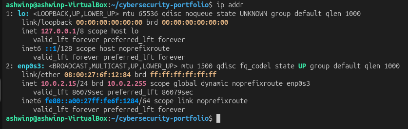
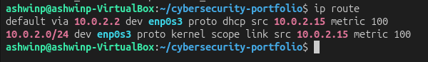
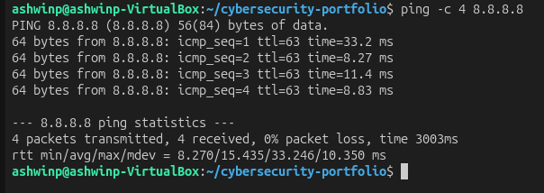
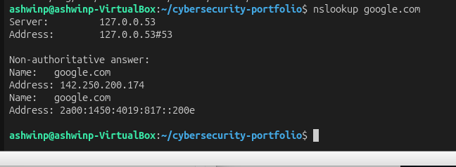
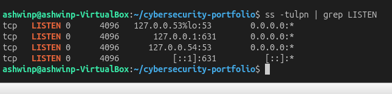
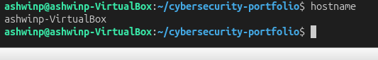
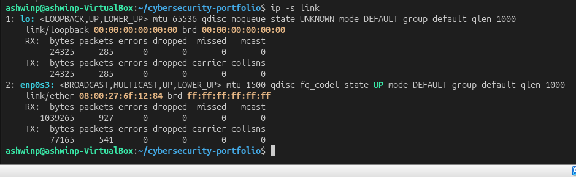
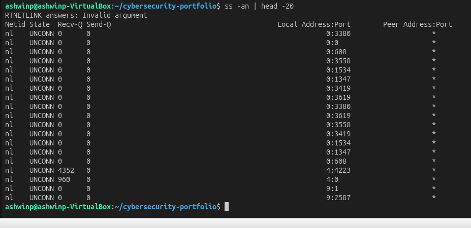

# Understanding Linux Networking Basics

## Objective
Learn how Linux systems connect to networks, understand IP addresses, DNS, routing, and network services.

## What I Did
1. Viewed network interfaces and IP configuration
2. Examined the routing table and how packets are routed
3. Tested network connectivity with ping
4. Performed DNS resolution lookups
5. Identified listening network services and ports
6. Analyzed active network connections
7. Checked system hostname and network statistics

## Key Findings

### Network Interfaces and IP Addresses
Network interfaces are how your system connects to networks. Common types:
- **lo (loopback)** — 127.0.0.1, only accessible locally
- **eth0/ens0** — Ethernet connection (wired)
- **wlan0** — WiFi connection (wireless)
- **docker0/veth** — Virtual interfaces for containers

Each interface has:
- **IP Address** — 192.168.x.x or 10.x.x.x (private), or public IPs
- **Netmask/CIDR** — defines which addresses are on the same network
- **MAC Address** — hardware identifier (48-bit address)
- **MTU** — maximum transmission unit (usually 1500 bytes)

### Routing Table
The routing table tells the system where to send packets:
- **Destination** — target network or host
- **Gateway** — router to use (0.0.0.0 or default gateway)
- **Metric** — cost of using this route (lower = better)
- **Interface** — which network adapter to use

Default route (0.0.0.0/0) is the "catch-all" for traffic not matching specific routes.

### DNS Resolution
DNS (Domain Name System) converts domain names to IP addresses:
- Query: nslookup google.com
- Response: google.com resolves to an IP address
- DNS servers are configured in `/etc/resolv.conf`

**Security Note:** DNS can be spoofed in attacks. This is why DNSSEC exists.

### Listening Network Services
Services that listen on ports:
- Port 22 (SSH) — secure shell access
- Port 80 (HTTP) — web traffic
- Port 443 (HTTPS) — encrypted web traffic
- Port 53 (DNS) — domain name resolution
- Port 25 (SMTP) — email
- Port 3306 (MySQL) — database

Seeing which ports are listening shows your **attack surface** — what an attacker can potentially exploit.

### Active Network Connections
Shows established connections:
- **LISTEN** — waiting for incoming connections
- **ESTABLISHED** — active connection
- **TIME_WAIT** — connection closing
- **SYN_SENT** — trying to establish connection

Monitoring these helps detect:
- Outbound malware communication
- Unauthorized connections
- Data exfiltration attempts

### Network Statistics
Interface statistics show:
- **RX** — packets/bytes received
- **TX** — packets/bytes transmitted
- **Errors** — corrupted packets
- **Dropped** — ignored packets

High error/drop rates indicate:
- Network problems
- Misconfiguration
- Potential attacks

## Security Implications

Understanding networking is crucial for:
- **Reconnaissance** — attackers map network services first
- **Exploitation** — many attacks target network services
- **Detection** — unusual network activity reveals compromises
- **Forensics** — network logs show data exfiltration

In HTB and real penetration testing:
- **Port scanning** — identify listening services
- **Service enumeration** — determine versions and vulnerabilities
- **Network mapping** — understand system architecture
- **Traffic analysis** — detect suspicious communications

## Commands I Used
```bash
ip addr                          # View network interfaces and IP addresses
ifconfig                         # Alternative (may not be installed)
ip route                         # Show routing table
ping -c 4 8.8.8.8               # Test connectivity
nslookup domain.com             # DNS resolution
dig domain.com                  # Detailed DNS information
ss -tulpn                       # Show listening ports and services
ss -tulpn | grep LISTEN         # Filter to listening only
ss -an                          # Show all network connections
hostname                        # Show system hostname
ip -s link                      # Network interface statistics
netstat -i                      # Interface statistics (if installed)
ip link show                    # Detailed interface information
```

## What I Learned

Networking is the **foundation of cybersecurity**. Key takeaways:

1. **Attack Surface** — Every open port is a potential entry point. This is why servers run only necessary services.

2. **Local vs Remote** — Local services (127.0.0.1) are safe, but services listening on 0.0.0.0 are accessible to anyone.

3. **Network Segmentation** — Private IP ranges (192.168.x.x, 10.x.x.x) are isolated from the internet, reducing risk.

4. **Visibility is Security** — Knowing what's listening, what's connected, and what's being transmitted is essential.

5. **DNS is Critical** — DNS resolution is fundamental but can be attacked. This is why DNSSEC and DNS filtering matter.

6. **Monitoring Matters** — Unusual network activity (strange ports, high data transfer, new connections) indicates compromise.

This is why in penetration testing and HTB:
- **Port scanning** is always the first step
- **Service identification** guides exploit selection
- **Network monitoring** detects your attacks
- **Firewall rules** are the first defense

## Screenshots

### Network Interfaces and IP Configuration

*System IP addresses and network interface configuration*

### Routing Table

*How the system routes packets to destinations*

### Ping Test

*Testing network connectivity to external server*

### DNS Resolution

*Converting domain names to IP addresses*

### Listening Services

*Network services accepting incoming connections*

### System Hostname

*System network name*

### Network Interface Statistics

*Transmitted, received, and error statistics*

### Active Network Connections

*Current network connections and their states*
