# Understanding Linux Process Management

## Objective
Learn how to view, monitor, and manage running processes on a Linux system. Understand which processes are consuming resources and identify potential security concerns.

## What I Did
1. Viewed all running processes on the system using `ps aux`
2. Analyzed process details including CPU, memory, and user ownership
3. Used `top` to monitor processes in real-time
4. Identified network services listening on ports using `ss`
5. Learned how to safely terminate processes using `kill` signals
6. Tested process termination with a test sleep process

## Key Findings

### Understanding Process Listings

I found **184 total processes** running on my Ubuntu system. The key columns in process listings are:
- **USER** — who the process is running as (root, ashwin, etc.)
- **PID** — unique process identifier
- **%CPU** — percentage of CPU being used
- **%MEM** — percentage of memory being used
- **COMMAND** — the actual process/command

### Root Processes vs User Processes

**Root Processes (System Level):**
- systemd — system manager
- kthreadd, kworker — kernel threads
- Various service daemons running with elevated privileges
- Most use 0.0% CPU/memory (idle, waiting for work)

**User Processes (My User - ashwin):**
- ptyxis — terminal emulator (9.9% memory)
- gnome-shell — desktop environment (10.2% memory)
- SSH agent, audio services, notification daemons
- Normal for a desktop system with GUI

**Security Implication:** Processes running as root have elevated privileges. Compromised root processes could give attackers full system control.

### Real-Time Process Monitoring with `top`

Running `top` shows:
- System load average (how busy the system is)
- Memory usage (total, free, used, buffered)
- Processes sorted by CPU/memory consumption
- Real-time updates of process resource usage

**Why This Matters:** In a production server, monitoring processes helps detect:
- Resource hogs (disk space, CPU, memory issues)
- Suspicious processes consuming unusual resources
- Malware or unauthorized scripts

### Network Services Listening on Ports

I found listening services using `ss -tulpn | grep LISTEN`:
- **Port 53** (127.0.0.1) — DNS service (localhost only)
- **Port 631** (127.0.0.1) — CUPS print service (localhost only)

**Security Finding:** All listening services are bound to **127.0.0.1 (localhost)**, meaning they're not accessible from the network. This is good security practice — only services that need external access should listen on 0.0.0.0.

### Process Signals and Termination

I learned about process signals:
- **SIGTERM (signal 15)** — graceful termination (allows cleanup)
- **SIGKILL (signal 9)** — forceful termination (immediate stop)

Tested with: `kill PID` (sends SIGTERM) successfully terminated a test process.

## Security Implications

In real-world systems:
- System administrators monitor processes to detect anomalies
- Attackers try to hide malicious processes or escalate privileges
- SUID processes running as root are prime targets for exploitation
- Listening ports reveal what services are exposed to the network
- Monitoring CPU/memory helps detect cryptominers or DDoS agents

## Commands I Used
```bash
ps aux                          # View all processes with details
ps aux | wc -l                  # Count total processes
ps aux | grep username          # View processes by user
top                             # Real-time process monitoring
ss -tulpn | grep LISTEN         # Show listening network services
sleep 3600 &                    # Start background process
kill PID                        # Send SIGTERM to process
kill -9 PID                     # Send SIGKILL to force terminate
```

## What I Learned

Process management is **fundamental to system administration and cybersecurity**. Key takeaways:

1. **Visibility is Security** — You can't protect what you don't monitor. Knowing what processes are running is the first step.

2. **Privilege Matters** — A root process compromised is much worse than a user process. This is why principle of least privilege is critical.

3. **Resource Monitoring Reveals Problems** — Unusual CPU/memory usage often indicates malware, misconfiguration, or attacks.

4. **Network Exposure** — Understanding which services listen on network ports shows your attack surface.

5. **Graceful vs Forceful** — SIGTERM allows processes to clean up (databases flush, connections close), while SIGKILL is destructive.

In cybersecurity and HTB machines, process analysis is essential for:
- Privilege escalation (finding vulnerable SUID binaries)
- Persistence (identifying startup processes)
- Lateral movement (understanding service dependencies)
- Incident response (detecting suspicious processes)

## Screenshots

### Processes with Detailed Information
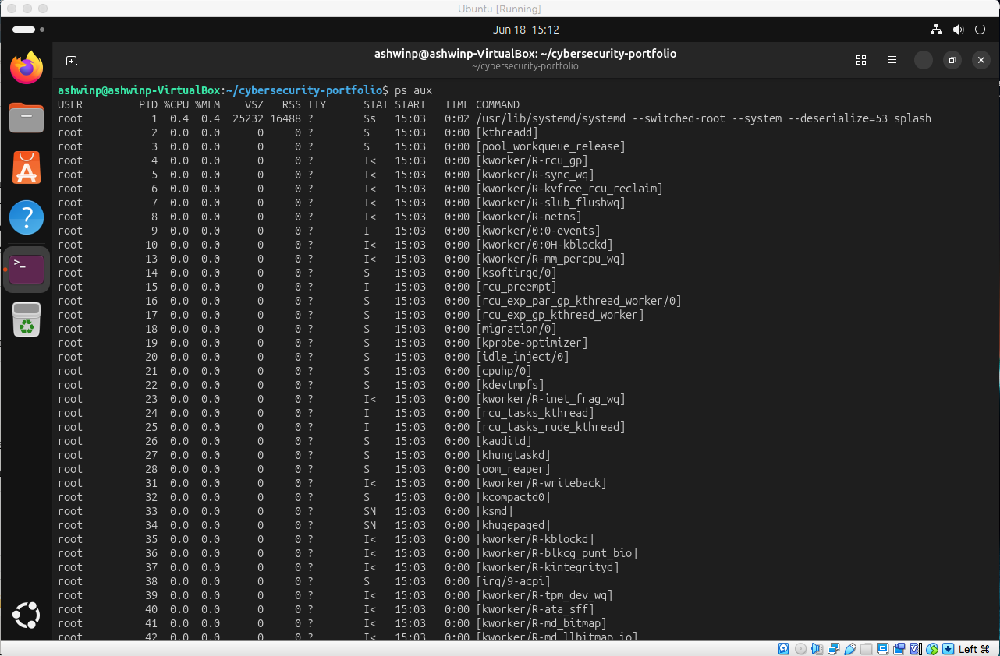
*Complete view of all running processes with CPU, memory, and command details*

### Process Count
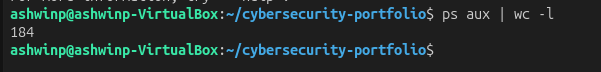
*System is running 184 processes — typical for Ubuntu desktop*

### Column Headers Explained
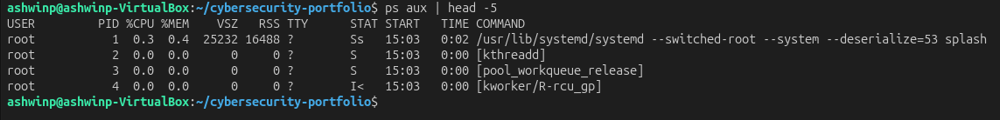
*Understanding the columns: USER, PID, CPU, MEM, COMMAND, etc.*

### Root Processes
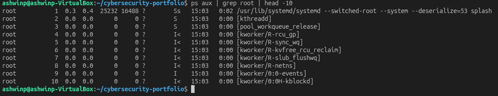
*System-level processes running with elevated root privileges*

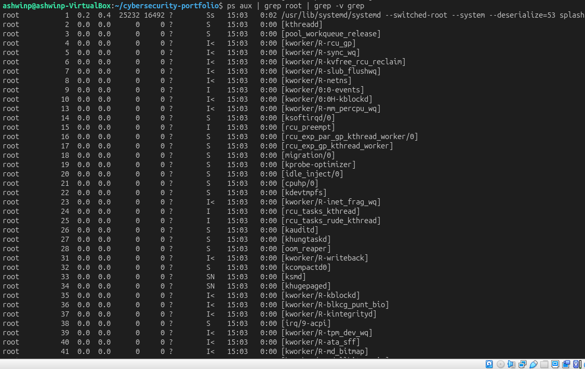
*Kernel threads and system services (mostly idle)*

### User Processes
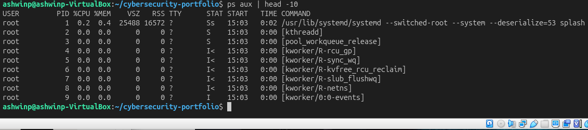
*First processes on the system showing mix of root and user processes*

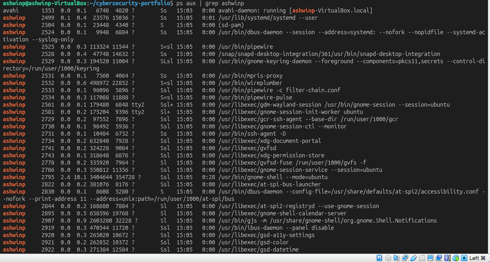
*Desktop and service processes running under my user account*

### Real-Time Monitoring with top
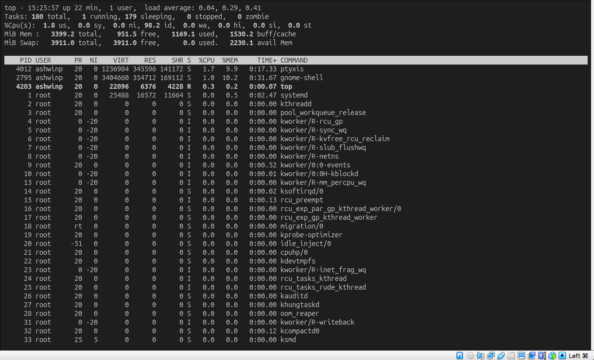
*Live view of processes sorted by resource consumption*

### Network Services
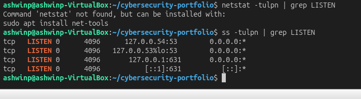
*Services listening on network ports (all safely on localhost)*

### Process Termination
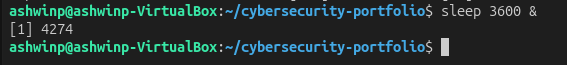
*Created test process running in background*

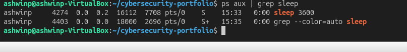
*Identified the PID of the test process*

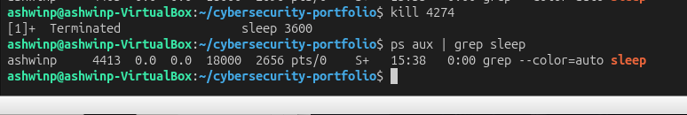
*Successfully terminated process using SIGTERM signal*
