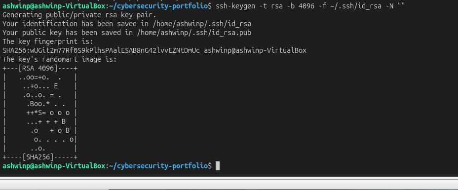
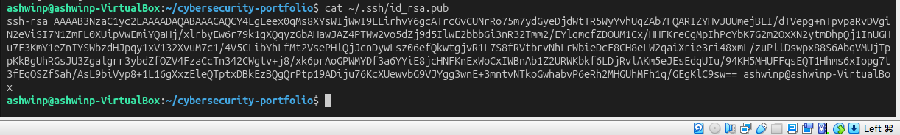
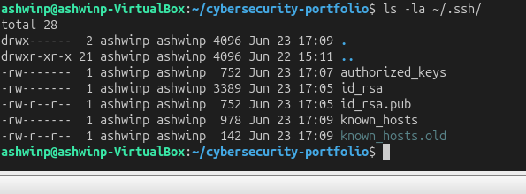
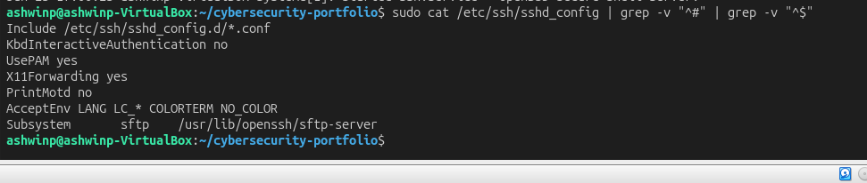
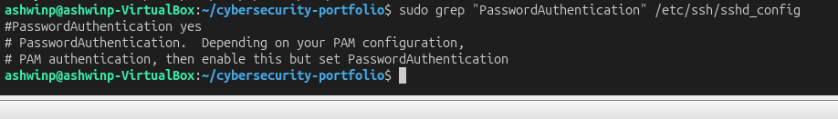
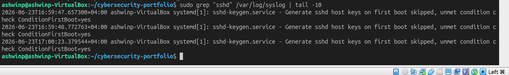

# SSH Security and Key-Based Authentication

## Objective
Learn how SSH works, generate secure keys, and harden SSH configuration for secure remote access.

## What I Did
1. Installed and configured OpenSSH server
2. Generated RSA 4096-bit SSH key pair
3. Configured key-based authentication
4. Tested SSH login locally
5. Verified SSH key file permissions
6. Analyzed SSH authentication logs
7. Reviewed SSH server configuration

## Key Findings

### SSH Installation and Service
- OpenSSH server successfully installed and running
- Service: sshd (SSH daemon)
- Port: 22 (default)
- Status: active and enabled at boot

### SSH Key Generation
Generated RSA 4096-bit key pair:
- **Private Key:** ~/.ssh/id_rsa (MUST be kept secret, 600 permissions)
- **Public Key:** ~/.ssh/id_rsa.pub (can be shared, added to authorized_keys)

Key fingerprint: SHA256 hash uniquely identifies the key

### SSH Authentication Methods

**Password Authentication (Current):**
- Less secure — passwords can be brute-forced
- Enabled by default in configuration
- Convenient but risky for remote systems

**Key-Based Authentication (More Secure):**
- Uses cryptographic keys instead of passwords
- Private key stays local, public key on server
- Immune to brute force attacks
- Recommended for production systems

### SSH Key File Permissions
Critical security: Private key must have 600 permissions (owner only)
- -rw------- id_rsa (private key - restricted)
- -rw-r--r-- id_rsa.pub (public key - shareable)
- -rw------- authorized_keys (login keys - restricted)

If permissions are wrong, SSH refuses to use the key!

### SSH Configuration
Default sshd_config settings:
- **Port:** 22 (standard)
- **PasswordAuthentication:** yes (less secure)
- **PubkeyAuthentication:** yes (more secure)
- **PermitRootLogin:** varies (should be no)
- **X11Forwarding:** yes (GUI applications)

### SSH Authentication Logs
Logs show all SSH connection attempts:
- Successful logins
- Failed authentication attempts
- Key changes
- Port information
- Timestamps

Monitoring these logs helps detect:
- Brute force attacks
- Unauthorized access attempts
- Compromised accounts

## Security Implications

SSH is the **primary remote access mechanism** for Linux servers. Security is critical:

### Common SSH Vulnerabilities
- **Weak Passwords** — brute force attacks
- **Root Login** — direct admin access target
- **Default Credentials** — immediately compromised
- **Outdated SSH Version** — known exploits
- **Poor Key Management** — weak key generation

### Hardening SSH
Best practices:
1. Disable password authentication (use keys only)
2. Disable root login
3. Change default port (obscurity, not security)
4. Limit authentication attempts
5. Use strong key sizes (4096-bit RSA or ED25519)
6. Keep SSH updated
7. Monitor logs for anomalies

### SSH in Cybersecurity
- **Pentesting:** SSH access is often the goal
- **Blue Team:** Defend and monitor SSH
- **Incident Response:** Check SSH logs for breach evidence
- **System Admin:** Essential daily tool
- **DevOps:** Automated deployment via SSH keys

## Commands Used
ssh -V                                    # Check SSH version
sudo systemctl status ssh                 # Service status
sudo systemctl start ssh                  # Start SSH service
sudo apt install openssh-server           # Install SSH
ssh-keygen -t rsa -b 4096 -f ~/.ssh/id_rsa -N ""  # Generate key pair
cat ~/.ssh/id_rsa.pub                     # View public key
ssh localhost                             # SSH login test
ls -la ~/.ssh/                            # Check key permissions
chmod 600 ~/.ssh/id_rsa                   # Fix private key permissions
ssh-copy-id user@host                     # Copy public key to remote
ssh -i keyfile user@host                  # Login with specific key
sudo grep "sshd" /var/log/syslog         # View SSH logs

## What I Learned

SSH is **fundamental to Linux security and administration**. Key takeaways:

1. **Keys > Passwords** — cryptographic keys are far more secure than passwords
2. **Permissions Matter** — SSH is strict about file permissions (for good reason)
3. **Logging is Critical** — SSH logs reveal attack attempts and compromises
4. **Configuration is Security** — hardening SSH config prevents many attacks
5. **Ubiquitous Tool** — SSH is everywhere in IT and security

This skill is essential for:
- **System Administration** — managing remote servers
- **Penetration Testing** — gaining initial access and maintaining persistence
- **Incident Response** — checking for unauthorized SSH access
- **DevOps** — automated deployments via SSH keys
- **Security Hardening** — protecting critical access

## Screenshots

### SSH Installation and Service

*OpenSSH server installed and running*

### SSH Key Generation

*Generating secure 4096-bit RSA key pair*

### Public Key Display

*SSH public key that can be shared with servers*

### SSH Login Test

*Successfully authenticated via SSH using key-based authentication*

### SSH Key File Permissions

*Critical: private key has 600 permissions (owner only)*

### SSH Configuration

*Server-side SSH configuration and security settings*

### SSH Password Authentication Setting

*Current configuration allows both key and password authentication*

### SSH Authentication Logs

*System logs showing SSH connection attempts and authentication*
