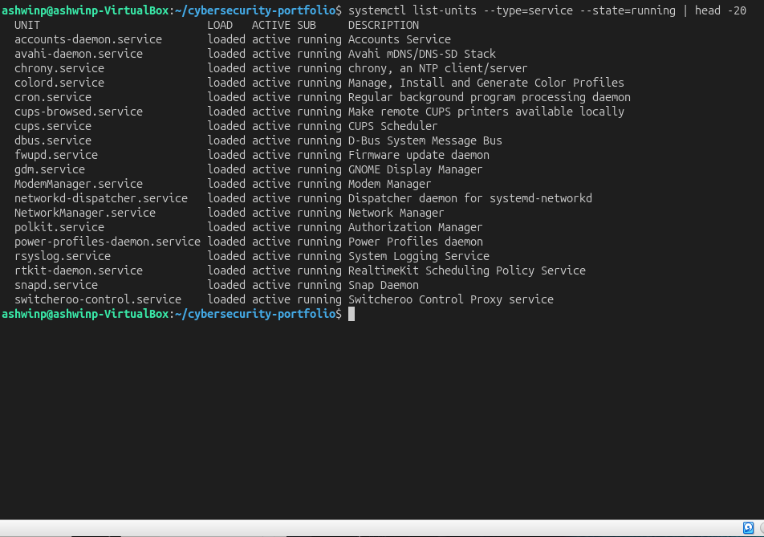
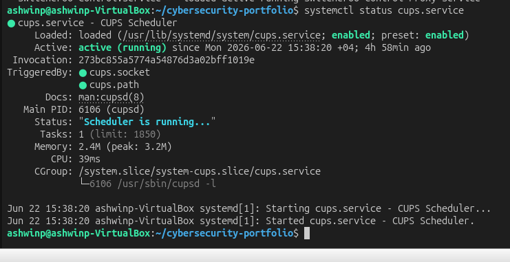
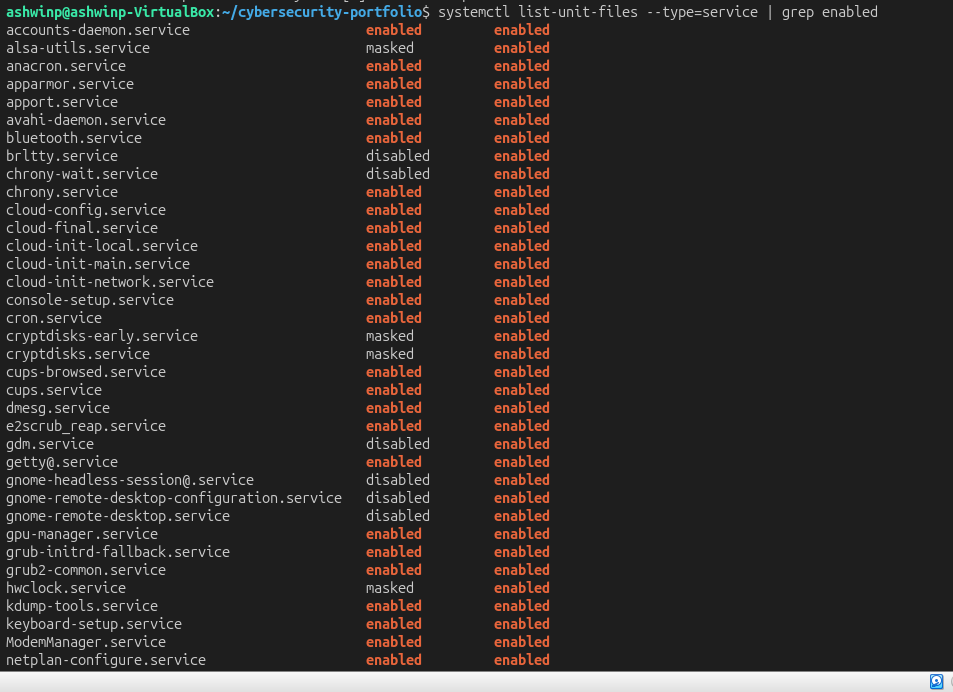
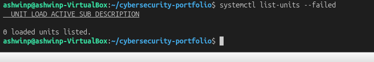
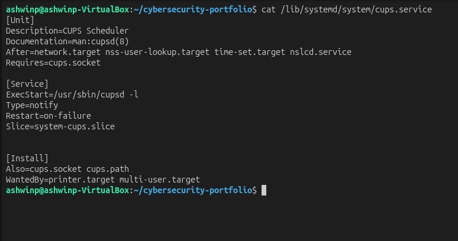
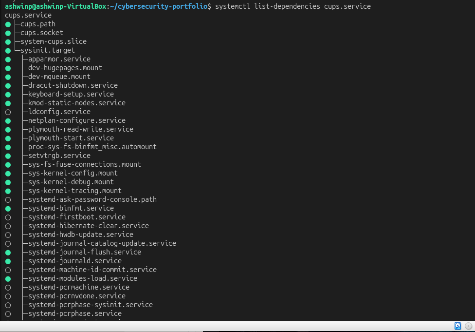
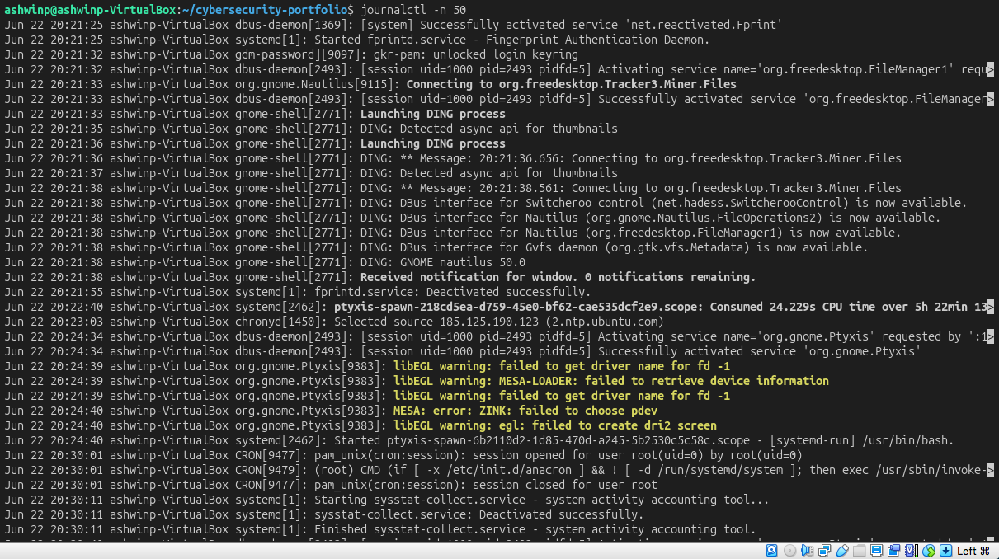

# Understanding Linux Service Management

## Objective
Learn how to view, manage, and control system services using systemd.

## What I Did
1. Listed all running services on the system
2. Checked status of individual services
3. Viewed services enabled at boot
4. Analyzed service configuration files
5. Examined service dependencies
6. Reviewed system logs and service logs
7. Identified failed services

## Key Findings

### Running Services
Found **20+ active services** running on the system including:
- accounts-daemon — user account service
- avahi-daemon — mDNS/DNS-SD discovery
- cups.service — print service
- dbus.service — system message bus
- NetworkManager — network management
- systemd-logind — login session management

### Service Management Basics

**What is systemd?**
systemd is the system and service manager on modern Linux systems. It handles:
- Starting services at boot
- Managing service dependencies
- Logging service activity
- Controlling service lifecycle

**Service States:**
- **active (running)** — service is currently running
- **enabled** — service starts automatically at boot
- **disabled** — service won't start automatically
- **failed** — service crashed or had errors

### Service Configuration
Services are defined in files like `/lib/systemd/system/cups.service`

Key sections:
- **[Unit]** — service description and dependencies
- **[Service]** — how to start/stop the service
- **[Install]** — when the service should be started

### Service Dependencies
Services often depend on other services:
- CUPS depends on dbus and basic system services
- Network services depend on NetworkManager
- User services depend on systemd-logind

Starting a service automatically starts its dependencies.

### Enabled Services at Boot
Services marked "enabled" start automatically when system boots. On this system:
- Core services (systemd-related)
- Display managers
- Network services
- System daemons

### System Logs
journalctl shows all system activity:
- Service starts/stops
- Errors and warnings
- Security events
- Hardware events

Checking logs is essential for troubleshooting and security monitoring.

## Security Implications

Service management is critical for security:
- **Unnecessary Services** — every service is a potential attack surface
- **Service Vulnerabilities** — exploits target specific services
- **Privilege Escalation** — compromised services running as root are dangerous
- **Persistence** — attackers modify services to maintain access
- **Detection** — monitoring service changes reveals compromises

Best Practices:
- Only enable required services
- Disable unnecessary services
- Monitor service logs for anomalies
- Regular service audits
- Check for unauthorized services

## Commands Used
```bash
systemctl list-units --type=service                    # List all services
systemctl list-units --state=running                   # List running services
systemctl status service-name                          # Check service status
systemctl list-unit-files --type=service               # List all service files
systemctl list-unit-files --type=service | grep enabled  # Show enabled services
systemctl list-units --failed                          # Find failed services
systemctl list-dependencies service-name               # Show service dependencies
journalctl -u service-name                            # View service logs
journalctl -n 50                                      # View recent system logs
cat /lib/systemd/system/service-name.service          # View service configuration
```

## What I Learned

Service management is **fundamental to Linux administration and security**. Key takeaways:

1. **Services are Everywhere** — modern systems run dozens of services
2. **Dependencies Matter** — services depend on each other
3. **Boot Behavior Matters** — enabled services are attack vectors
4. **Logs Tell Stories** — service logs reveal what's happening
5. **Control is Power** — managing services is core admin skill

This is essential for:
- **System Hardening** — disable unnecessary services
- **Security Monitoring** — watch service logs for anomalies
- **Incident Response** — check service changes during investigations
- **Performance** — stop unnecessary services to free resources
- **HTB/Pentesting** — manipulating services gains access or persistence

## Screenshots

### Running Services Available

*20+ active services on the system*

### CUPS Service Status

*Example of checking individual service status*

### Enabled Services at Boot

*Services that start automatically on system boot*

### Failed Services

*Checking for services that had errors*

### Service Configuration File

*Understanding service configuration and startup parameters*

### Service Dependencies

*Services and their dependencies*

### System Journal Logs

*System activity logs from journalctl*
