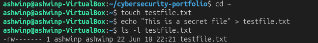
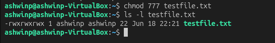
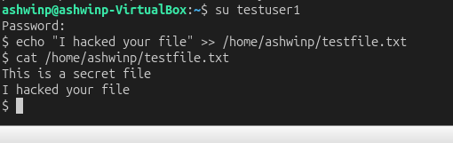
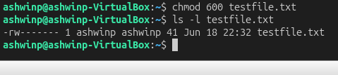
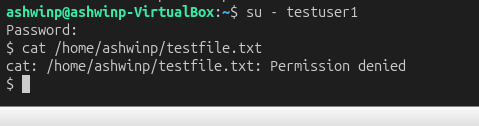
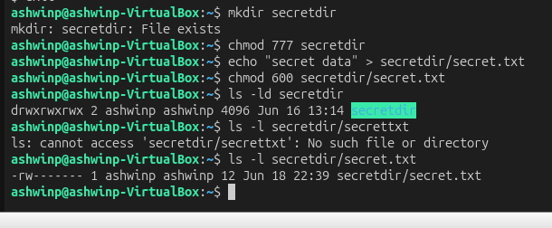

# Understanding Linux File Permissions

## Objective
Understand how file permissions work and why misconfigured permissions are a critical security risk.

## What I Did
1. Created test users on my system (testuser1, testuser2, testuser3)
2. Created a test file and changed its permissions multiple times
3. Tested what different users could access with different permission levels
4. Documented the security implications of each permission configuration
5. Tested directory vs file permissions and how they interact

## Key Findings

### 777 Permissions (World-Writable) - DANGEROUS 
- When I set a file to `chmod 777`, ANY user on the system could read, write, and execute it
- testuser1 was able to modify my file by appending text to it
- This happened even though I created the file and testuser1 is a different user
- **Security Risk:** This is how privilege escalation and data breaches happen

### 600 Permissions (Owner Only) - SECURE ✓
- After changing permissions to `chmod 600`, only my user could access the file
- testuser1 got "Permission denied" when trying to read or modify it
- **Lesson:** Always restrict permissions to only those who need them

### Directory Permissions Matter Too
- Even if a file has secure permissions (600), the **directory permissions also matter**
- A 777 directory allows anyone to access what's inside
- However, if the file inside is 600, users still can't read it (file permissions take precedence)
- But if the file is 644 (world-readable), users CAN read it in a 777 directory
- Fixed by setting directory to `chmod 700` so only owner can enter

**Key Lesson:** Both file AND directory permissions must be considered together for proper security.

## Security Implications

In real production servers:
- World-writable files in `/tmp` or `/var` can lead to data breaches and system compromise
- SUID binaries with weak permissions can be exploited for privilege escalation attacks
- This is why system administrators regularly audit file and directory permissions
- Many security breaches happen because of misconfigured permissions, not fancy hacking
- Principle of least privilege means: give only the minimum permissions needed

## Commands I Used
```bash
chmod 777 testfile.txt        # Make file world-writable (VERY DANGEROUS)
chmod 600 testfile.txt        # Owner only (SECURE)
chmod 644 testfile.txt        # Owner read/write, others read-only
chmod 700 directoryname       # Owner only access to directory
chmod 777 directoryname       # World-writable directory
ls -l                         # View file permissions
ls -ld directoryname          # View directory permissions
su - testuser1                # Switch to another user
whoami                        # Show current user
```

## What I Learned

Understanding file permissions is not just a Linux skill — it's a **fundamental cybersecurity skill**. Most organizations have security issues because of misconfigured permissions allowing unauthorized access to sensitive files.

Key takeaways:
- Permissions are the first line of defense against unauthorized access
- Always think about the principle of least privilege (only give access that's needed)
- Directory and file permissions work together — you need to secure BOTH
- File permissions take precedence over directory permissions for reading
- Directory permissions control what operations you can do inside (read, write, execute)
- This is one of the first things security professionals audit on any system

## Screenshots

### Original File Permissions

*Initial state of testfile.txt*

### File Set to 777 Permissions

*File set to 777 - anyone can modify*

### testuser1 Modifies 777 File

*Demonstrates the danger of 777 permissions*

### File Set to 600 Permissions

*File restricted to owner only*

### testuser1 Denied Access to 600 File

*testuser1 cannot read or modify secure file*

### Directory 777 File 600

*Testing both directory and file permissions together*

### testuser1 Can Access Due to Directory Permissions

*World-readable file in 777 directory is accessible*

### testuser1 Denied After chmod 700 Directory

