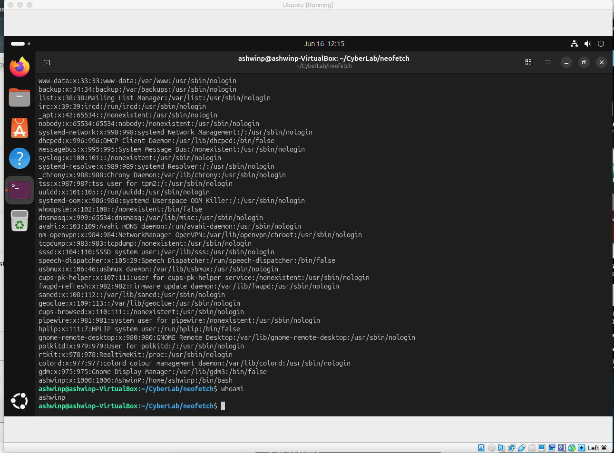
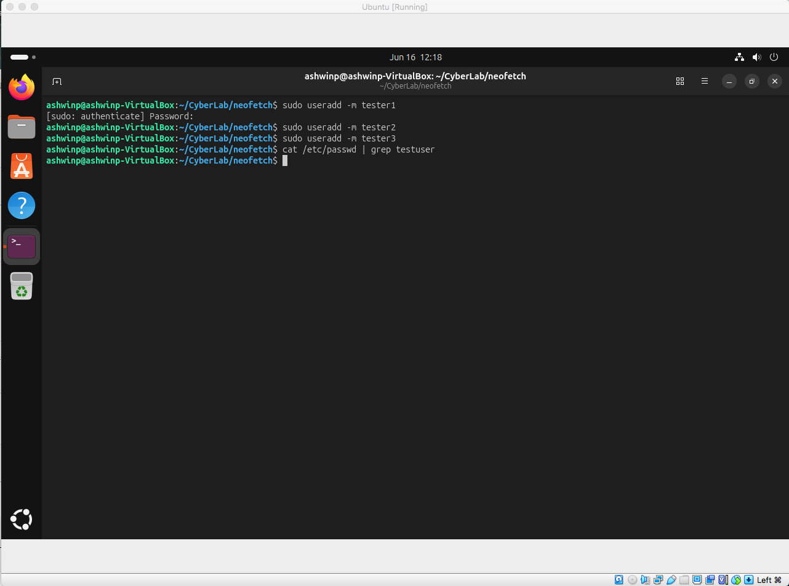
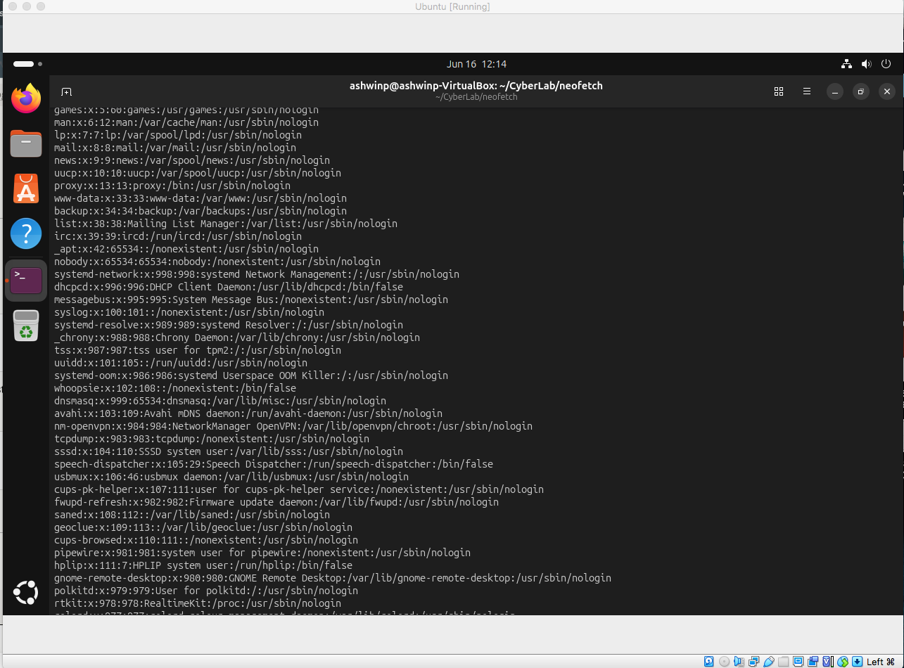
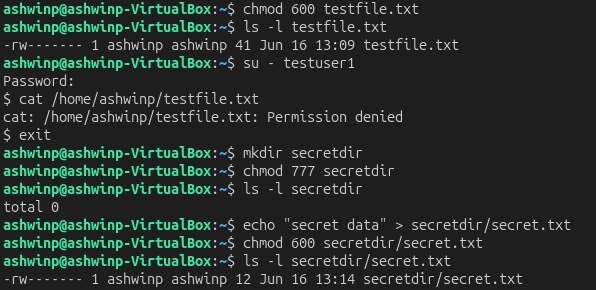
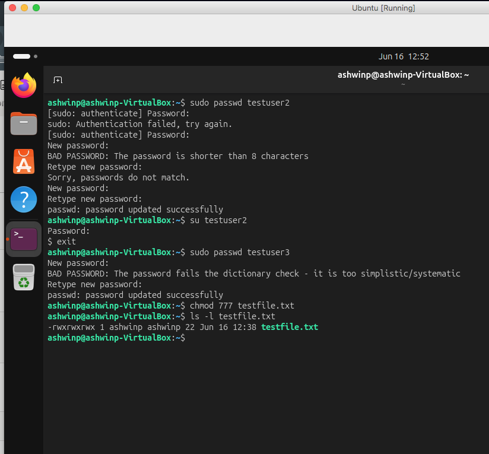

# Understanding Linux File Permissions

## Objective
Understand how file permissions work and why misconfigured permissions are a critical security risk.

## What I Did
1. Created test users on my system (testuser1, testuser2, testuser3)
2. Created a test file and changed its permissions multiple times
3. Tested what different users could access with different permission levels
4. Documented the security implications of each permission configuration

## Key Findings

### 777 Permissions (World-Writable) - DANGEROUS ⚠️
- When I set a file to `chmod 777`, ANY user on the system could read, write, and execute it
- testuser1 was able to modify my file by appending text to it
- This happened even though I created the file and testuser1 is a different user
- **Security Risk:** This is how privilege escalation and data breaches happen

### 600 Permissions (Owner Only) - SECURE ✓
- After changing permissions to `chmod 600`, only my user could access the file
- testuser1 got "Permission denied" when trying to read or modify it
- **Lesson:** Always restrict permissions to only those who need them

### Directory Permissions Matter Too
- Even if a file has secure permissions (600), if the parent directory is world-writable (777), others can still access it
- This taught me that security requires thinking about the whole path, not just individual files
- Fixed by setting directory to `chmod 700` so only owner can enter

## Security Implications

In real production servers:
- World-writable files in `/tmp` or `/var` can lead to data breaches and system compromise
- SUID binaries with weak permissions can be exploited for privilege escalation attacks
- This is why system administrators regularly audit file and directory permissions
- Many security breaches happen because of misconfigured permissions, not fancy hacking

## Commands I Used
```bash
chmod 777 testfile.txt        # Make file world-writable (VERY DANGEROUS)
chmod 600 testfile.txt        # Owner only (SECURE)
chmod 700 directoryname       # Owner only access to directory
ls -l                         # View file permissions
ls -ld directoryname          # View directory permissions
su - testuser1                # Switch to another user
whoami                        # Show current user
```

## What I Learned

Understanding file permissions is not just a Linux skill — it's a **fundamental cybersecurity skill**. Most organizations have security issues because of misconfigured permissions allowing unauthorized access to sensitive files.

Key takeaways:
- Permissions are the first line of defense against unauthorized access
- Always think about the principle of least privilege (only give access that's needed)
- Directory and file permissions work together
- This is one of the first things security professionals audit on any system

## Screenshots

### Step 1: Original File Permissions

*Initial state of testfile.txt*

### Step 2: World-Writable (777) - Dangerous

*File set to 777 - anyone can modify*

### Step 3: testuser1 Successfully Modifies File

*Demonstrates the danger of 777 permissions*

### Step 4: Secure Permissions (600)

*File restricted to owner only*

### Step 5: Directory Permissions Matter

*Testing directory vs file permissions*
## Screenshots


